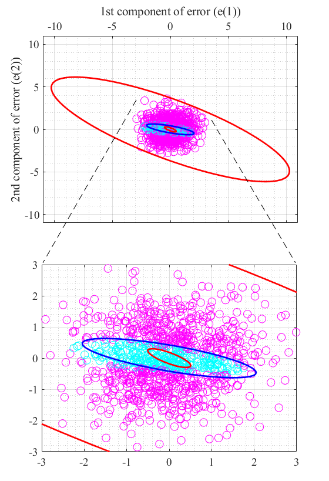

# InterQ: A DQN Framework for Optimal Intermittent Control

**InterQ** is a Python implementation of a Deep Q-Learning (DQN) based algorithm for solving optimal scheduling and control in stochastic linear systems. The framework is designed for **intermittent control problems** where communication between a sensor and a controller is costly or constrained.

InterQ learns when to transmit sensor measurements to a remote controller. It uses deep reinforcement learning to find a Pareto-optimal trade-off between control performance and communication cost.

---

## 🚀 Features

- ✅ Deep Q-Network (DQN) for optimal scheduling  
- ✅ Separation-based controller design (certainty-equivalence)  
- ✅ Experience Replay and slow target network update for stable training  
- ✅ Visualizations of scheduling policy landscapes  
- ✅ Benchmarking against baseline policies (periodic and event-triggered)

---

## 📖 Problem Setting

We consider a discrete-time linear stochastic system with two active decision-makers:

- **Scheduler**: Observes the full system state and decides when to transmit data  
- **Controller**: Receives transmissions and applies control actions

The objective is to minimize a long-term cost that combines:

- Quadratic control cost  
- Communication/scheduling cost

---

## 🧠 Algorithm Overview

InterQ uses a Deep Q-Network (DQN) to approximate the action-value function `Q(e, a)`, where `e` is the estimation error and `a` is the scheduling action (`schedule` or `no-schedule`).  
The controller follows an optimal certainty-equivalence strategy based on its current estimate.

---

## 📊 Visualization

- Scheduling Landscape: Understand when InterQ chooses to transmit
- Control-Communication Tradeoff: Compare against periodic and event-based policies
- Pareto Fronts: Quantify optimality in multi-objective space

---

## 🧪 Baselines

Compare InterQ against:
- BS1: Periodic scheduling with fixed interval
- BS2: Event-triggered scheduling based on thresholded estimation error

## 📈 Results

InterQ consistently outperforms both baselines across a wide range of system parameters and penalty weights. It learns an intelligent policy that balances control accuracy with communication cost.

## 📝 Citation

If you use this code for your research or publication, please cite:

@article{interq2025,
  title     = {InterQ: A DQN Framework for Optimal Intermittent Control},  
  author    = {Aggarwal, Shubham and Maity, Dipankar and Ba\c{s}ar, Tamer},  
  journal   = {arXiv preprint arXiv:2504.09035},  
  year      = {2025}
}

